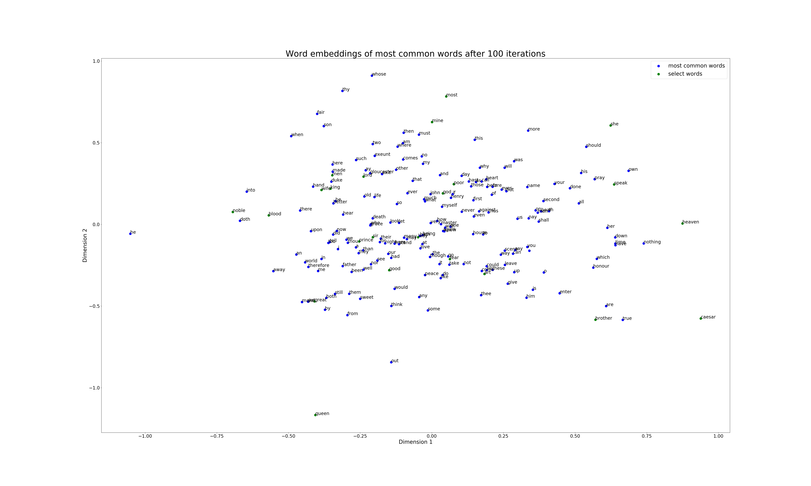
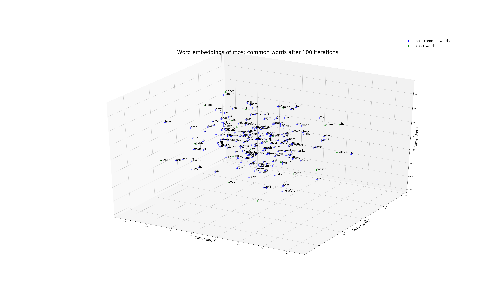

# Visualizing-Word-Embeddings-using-CBOW-Model
Visualizing word embeddings by implementing the CBOW (continious bag of words) model and using shallow neural network with one fully connected dense hidden layer

**Dataset**
- [The Complete Works of William Shakespeare](https://www.kaggle.com/kewagbln/shakespeareonline)

**Classes**
- DatasetProcessing : class to process dataset, get the required parameters and print info on interface using standard logger
- Model : class to define the shallow neural network model, gradient descent and word embeddings
- PlotCode : class to generate and save 2D and 3D plots of the word embeddings from the trained model

**Executables**
- TrainModel : Initializes and trains the neural network, extracts word embeddings and generates 2D and 3D plots to visualize the word embeddings

**Results**
- 2D Plots of word embeddings :  
    word embeddings after 20 iterations  
       
    word embeddings after 40 iterations  
       
    word embeddings after 60 iterations  
       
    word embeddings after 80 iterations  
       
    word embeddings after 100 iterations  
       
    word embeddings after 140 iterations  
       
    word embeddings after 180 iterations  
       
    word embeddings after 200 iterations  
       
- 3D Plots of word embeddings :  
    word embeddings after 50 iterations  
       
    word embeddings after 100 iterations  
       
    word embeddings after 150 iterations  
       
    word embeddings after 200 iterations  
       
